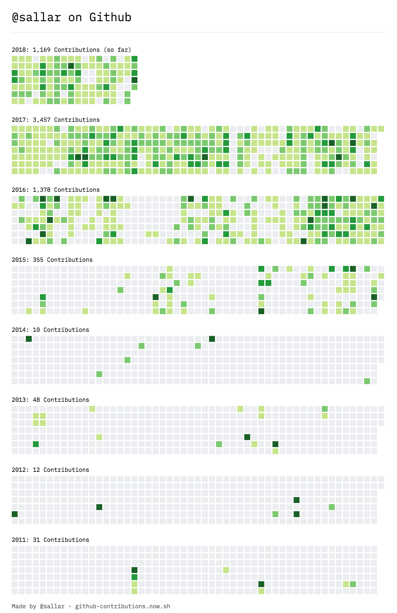

# :octocat: GitHub Contribution Chart Generator [](https://github.com/sallar/github-contributions-canvas/blob/master/LICENSE)

Generates an image of all your **GitHub** contributions since you have signed up, so you can use it in social media.

The API for this project [lives here](https://github.com/sallar/github-contributions-api) which is also written by me since GitHub doesn't provide a way to access user statistics through it's official API.

The drawing mechanism lives in [its own repository](https://github.com/sallar/github-contributions-canvas) too.

## Install

Install the packages using [NPM](https://nodejs.org/en/):
```
$ npm install ./github-contributions-chart
```
Or [download as ZIP](https://github.com/sallar/github-contributions-chart/archive/master.zip).

## How to run

Running locally:
```
$ npm start ./github-contributions-chart
```

## Adding themes

Add your theme to [sallar/github-contribution-canvas](https://github.com/sallar/github-contributions-canvas) repo and also send a PR here to add the name of the theme to the list.

## Example

<div align="center">
  
</div>

## Contributing

Please read [CONTRIBUTING.md](./CONTRIBUTING.md) for details on our code of conduct, and the process for submitting pull requests to us.

## Changelog

Every release, along with the migration instructions, is documented on the Github [Releases](https://github.com/sallar/github-contributions-chart/releases) page.

## License

[MIT license](https://opensource.org/licenses/MIT)
